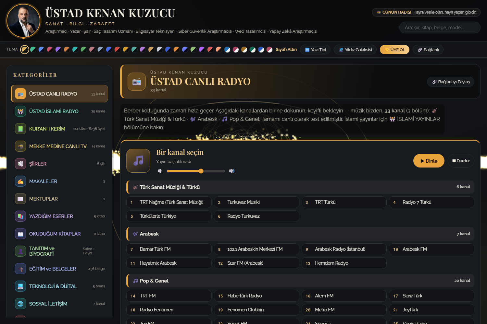
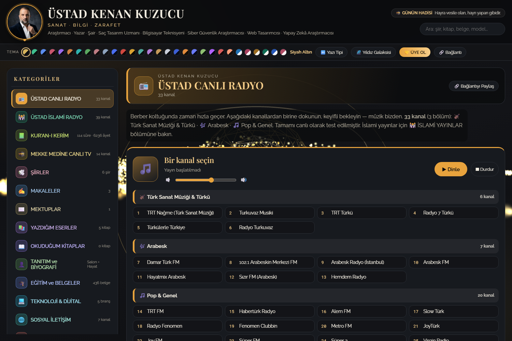
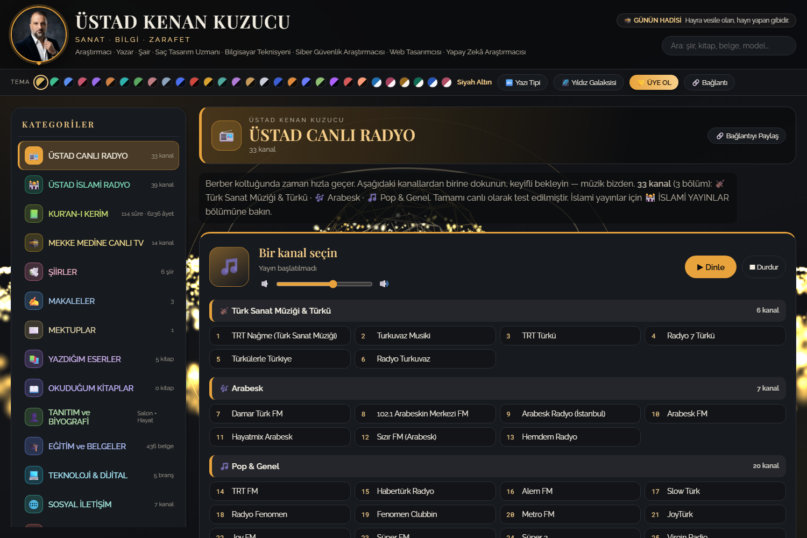
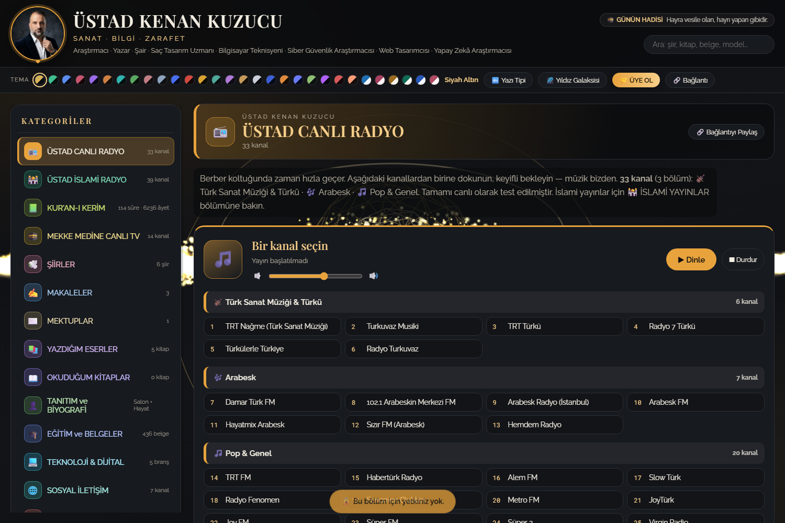
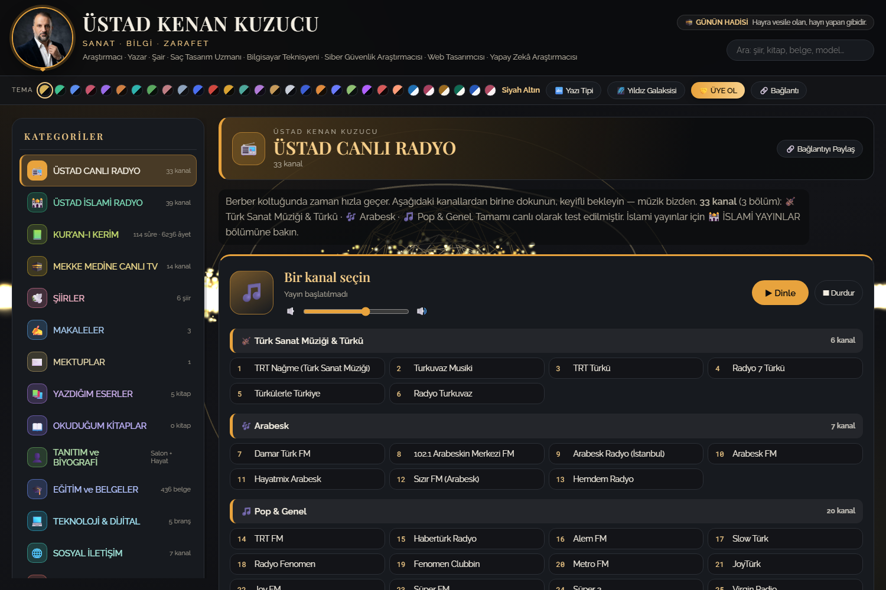

# 💈 ÜSTAD SALON KENAN — WEB SİTESİ

> Gaziantep · Selimiye Mahallesi · **ÜSTAD SALON KENAN** erkek kuaförü
> ve Kenan Kuzucu'nun yazı, şiir, kitap ve araştırma dünyası — **tek dosyada, tek klasörde.**

Canlı radyolar, Kur'an-ı Kerim, canlı TV, şiirler, makaleler, kitaplar, 3D sahne,
oyunlar ve yönetim paneli. Tamamı **kendi bilgisayarında çalışır**; 3D ve fotoğraflar
internetsiz de açılır.

---

## 🧭 Sol menüdeki 18 bölüm

| # | Bölüm | Ne var |
|---|---|---|
| 1 | 📻 **ÜSTAD CANLI RADYO** | 33 kanal (Sanat 6 · Arabesk 7 · Pop 20), kendi oynatıcısı |
| 2 | 🕌 **ÜSTAD İSLAMİ RADYO** | 39 kanal (İslami/Türkçe 11 · Kur'an 28) |
| 3 | 📗 **KUR'AN-I KERİM** | 114 sûre · 6.236 âyet: Arapça metin + meal + tefsir + 604 sayfalık mushaf (19 hat) |
| 4 | 🕋 **MEKKE MEDİNE CANLI TV** | 14 kanal, hls.js oynatıcı + yan kanal listesi |
| 5 | 🕊️ **ŞİİRLER** | Şairin kendi şiirleri |
| 6 | ✍️ **MAKALELER** | Kendi yazıları |
| 7 | ✉️ **MEKTUPLAR** | |
| 8 | 📚 **YAZDIĞIM ESERLER** | Kitaplar (kapak, önsöz, tanıtım) + film senaryoları |
| 9 | 📖 **OKUDUĞUM KİTAPLAR** | Kitap özetleri (tam sayfa) |
| 10 | 👤 **TANITIM ve BİYOGRAFİ** | Salon hizmet/fiyat/saat + tam biyografi |
| 11–16 | 🎮 **OYUNLAR** · 🖼️ Galeri · 📞 İletişim · ⚙️ Ayarlar · 👑 **ÜSTAD YÖNETİM** · ... | |

Ziyaretçi 16 bölüm görür; **👑 ÜSTAD YÖNETİM** her zaman yalnız site sahibine özeldir.

---

## ✨ Öne çıkanlar

- **3D sahne (three.js)** — 8 tatlı 3D sahne, tema ve hız kontrolü.
- **19 Arapça hat** — Kur'an ve başlıklar için mushaf yazı tipleri (yerel `.woff2`, internet gerekmez).
- **Canlı yayın** — radyo (33+39 kanal) ve TV (14 kanal) oynatıcıları.
- **Yönetim paneli** — içerik ekleme, üye yönetimi, PIN koruması.
  Üye şifreleri **düz metin saklanmaz**: rastgele tuz + 5.000 turlu **SHA-256**.
- **Tema & yazı tipi motoru** — çok sayıda renk ve font seçeneği.
- **Çevrimdışı çekirdek** — 3D, fotoğraflar ve içerik yerel.

---

## 📸 Ekran görüntüleri

<table>
<tr>
<td width="50%"><b>Açılış ekranı</b><br></td>
<td width="50%"><b>ÜSTAD CANLI RADYO · 33 kanal</b><br></td>
</tr>
<tr>
<td><b>KUR'AN-I KERİM · 114 sûre / 6.236 âyet</b><br></td>
<td><b>OYUNLAR · dama, satranç, tavla</b><br></td>
</tr>
</table>

<b>TANITIM ve BİYOGRAFİ</b><br>

---

## 🚀 Nasıl açılır

```bash
git clone https://github.com/kenankuzucu/ustad-salon-kenan-web.git
cd ustad-salon-kenan-web
# index.html dosyasına çift tıkla — hepsi bu.
python -m http.server 8080   # (istersen yerel sunucu)
```

Yönetim paneli: adresin sonuna `#yonetim` ekle veya **Ctrl + Alt + Y**.
(İlk giriş PIN'i panelin ilk açılışında belirlenir.)

---

## 🗂️ Dosya düzeni

```
ustad-salon-kenan-web/
├─ index.html        sitenin kendisi (tasarım + düzen)
├─ veri.js           BÜTÜN yazılar burada (şiir, makale, kitap, telefon, sosyal medya)
├─ uygulama.js       menü, 3D sahne, radyo, tema/font motoru
├─ yonetim.js        yönetim paneli (içerik + üye yönetimi)
├─ oyunlar.js        oyun merkezi · oyun-dama / satranc / tavla / sorular
├─ three.min.js      gerçek 3D motoru (yerel)
├─ hls.min.js        canlı TV oynatıcı
├─ kuran/            sûre listesi, 6.236 âyet (Arapça + meal), tefsir
├─ font/             19 Arapça hat (.woff2)
├─ foto/             madalyon, portre, Atatürk, 12 saç modeli
├─ logo/             4 zarif logo + favicon + sosyal ikonlar
├─ kod/              logo üreteci, içerik ekleme aracı, Word üreteçleri
└─ OKU-BENI.md       ayrıntılı kullanım kılavuzu
```

---

## ⚖️ Notlar

- İçerik sahibi: **Kenan Kuzucu** — Gaziantep / Selimiye Mah., ÜSTAD SALON KENAN.
- Sitedeki yazı, şiir, kitap ve fotoğrafların hakları sahibine aittir.
- Bu depo bir **vitrin/arşiv** amacıyla yayımlanmıştır.
